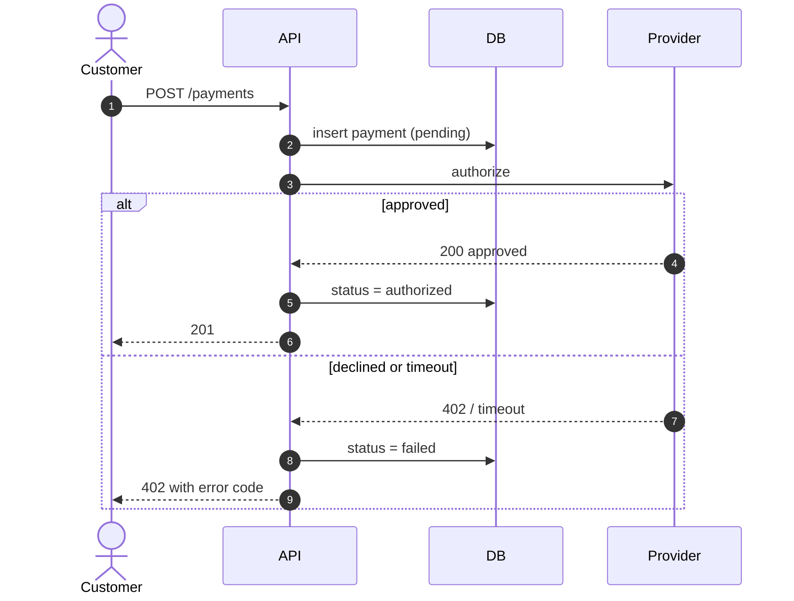

# Flows

## Flow name (e.g. Card payment)

```mermaid
sequenceDiagram
    autonumber
    actor C as Customer
    participant API
    participant DB
    participant P as Provider
    C->>API: POST /payments
    API->>DB: insert payment (pending)
    API->>P: authorize
    alt approved
        P-->>API: 200 approved
        API->>DB: status = authorized
        API-->>C: 201
    else declined or timeout
        P-->>API: 402 / timeout
        API->>DB: status = failed
        API-->>C: 402 with error code
    end
```

Idempotency, retries, timeouts and what happens on partial failure, grounded in code.
